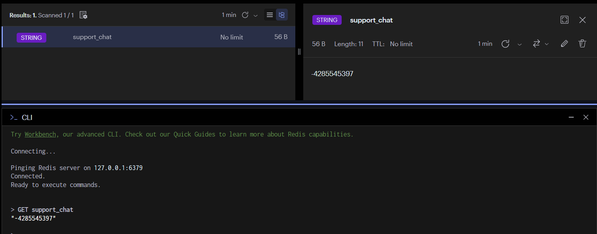
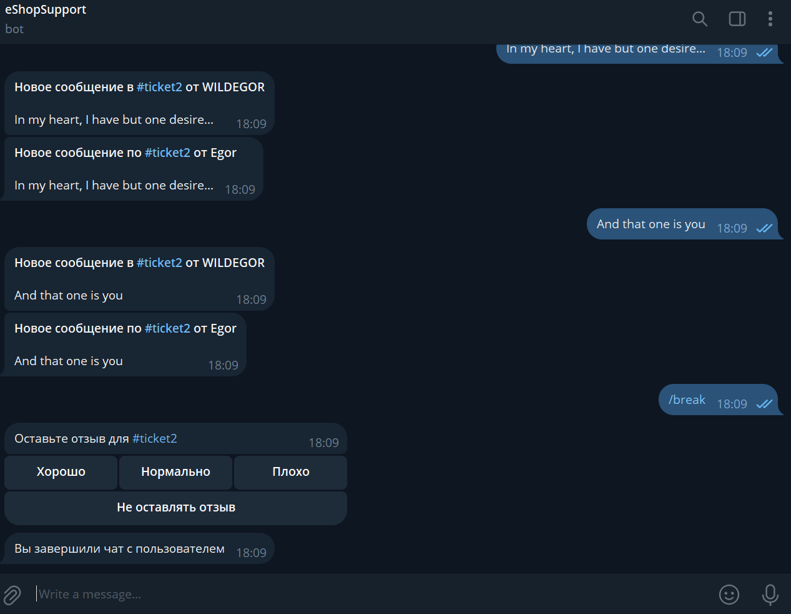
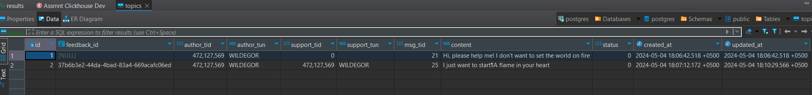

<h1 align="center"> eShop - support bot </h1> <br>
<hr>
<p align="center">
  Microservice handles support via Telegram Bot
</p>
<hr>

[](https://opensource.org/licenses/MIT)
[](https://github.com/WildEgor/e-shop-support-bot/actions/workflows/lint.yml)
[](https://codecov.io/gh/WildEgor/e-shop-support-bot/branch/develop)
[](https://goreportcard.com/report/github.com/WildEgor/e-shop-support-bot)

## Table of Contents
- [Introduction](#introduction)
- [Features](#features)
- [Requirements](#requirements)
- [Quick Start](#quick-start)
- [Contributing](#contributing)

## Introduction

The service allows receiving messages from users of the chatbot with inquiries and creating a "ticket" for the support. 
Support agents can receive feedback gathered for analytics.

## Features

- **Question Submission**: Users can submit questions through the Telegram bot interface;
- **Question Processing**: Incoming questions stored in a database and processed by support group;
- **Analytics**: Optionally collects statistics like feedbacks for insights into user behavior;

## Requirements

- [Git](http://git-scm.com/)
- [Go >= 1.22](https://go.dev/dl/)
- [Docker](https://www.docker.com/products/docker-desktop/)
- [Postgres and Redis](https://github.com/WildEgor/e-shop-dot/blob/develop/docker-compose.yaml)

## Quick start

1. Создайте бота с помощью [BotFather](https://t.me/BotFather) ([video instruction](https://www.youtube.com/watch?v=UQrcOj63S2o))
For example, [eShopSupport](t.me/eshop_support_bot)
2. Run application locally
Clone repository, modify environment and run it
```shell
git pull https://github.com/WildEgor/e-shop-support-bot &&
cd e-shop-support-bot &&
cp .env.example .env &&
go mod download &&
go run cmd/main.go
```
or using Docker
```shell
docker-compose up bot
```

3. Create group in Telegram, add bot and make it admin. Next you can check saved group id using redis-cli


In a support group, you will receive "tickets" with user questions. Group users can "accept" or "reject" a ticket. If a ticket is "rejected," a new one can be created.


If the ticket is "accepted," users can discuss the issue through messages to the bot. Messages "duplicate" because I'm testing the functionality with the same account (pay attention to the sender of the message).


You can find "tickets" in the database table ```public.topics```


## Contributing

Please, use git cz for commit messages!

```shell
git clone https://github.com/WildEgor/e-shop-support-bot
cd e-shop-support-bot
git checkout -b feature-or-fix-branch
git add .
git cz
git push --set-upstream-to origin/feature-or-fix-branch
```

## License

<p>This project is licensed under the <a href="LICENSE">MIT License</a>.</p>

Made with ❤️ by me